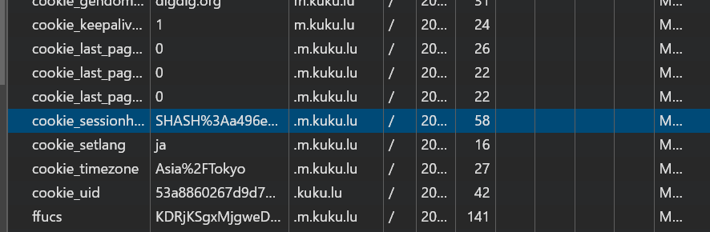

# kukumail.js

JavaScript Library for "m.kuku.lu"
Created by [@amex2189](https://twitter.com/amex2189)
Temp Mail | 捨てメアドサービス

注意(JP): SESSIONは何度も生成すると弾かれます。弾かれた場合はWebからcf_clearnceを取得するか、ipを変更してください。出来るだけ一度生成したら使いまわしてください。  
Attention(EN): createAccount should be called only once the first time to obtain the sessionHash.

-   ALL Features
-   Send Email
-   Create Any Email
-   Get Mail
-   Delete Email
-   Get Mailbox
-   And more

## Usage

```bash
npx jsr add @edamame-x/kukumailjs
pnpx jsr add @edamame-x/kukumailjs
bunx jsr add @edamame-x/kukumailjs
deno add @edamame-x/kukumailjs
```

```ts
import { Kukumail } from "../class/kukumail";

// Get from cookies
const kukumail = new Kukumail({ sessionHash: "SHASH%3A..." });
await kukumail.initlize();
const result = await kukumail.createRandomEmail();
if (result.type === "error") {
    console.error(result.data);
}else{
    console.log(result.data);

    const result2 = await kukumail.getReceivedMails();
    if (result2.type === "error") {
        console.error(result2.data);
    }else {
        console.log(result2.data);

        const result3 = await kukumail.getMailContent("recv", result2.data[0].id);

        if (result3.type === "error") {
            console.error(result3.data);
        }else {
            console.log(result3.data);
        }
    }
}

// And more

// OR
const kukumail = new Kukumail({});
await kukumal.createAccount();
await kukumail.initlize();
console.log(kukumail.sessionHash);
// Attention: createAccount should be called only once the first time to obtain the sessionHash.
```



And more: [https://jsr.io/@edamame-x/kukumailjs/doc](https://jsr.io/@edamame-x/kukumailjs/doc)
Question: [https://discord.gg/MrtfbAcP3K](https://discord.gg/MrtfbAcP3K)
